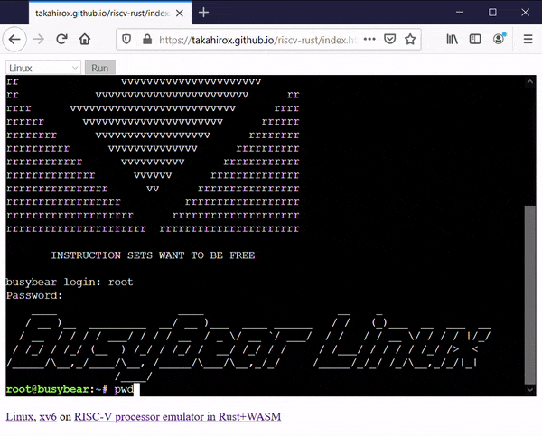
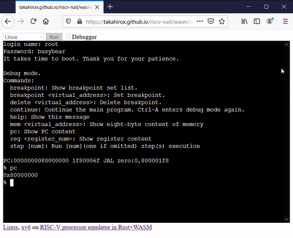

# riscv-rust

[](https://crates.io/crates/riscv_emu_rust)
[](https://badge.fury.io/js/riscv_emu_rust_wasm)

riscv-rust is a [RISC-V](https://riscv.org/) processor and peripheral devices emulator written in Rust and compilable to WebAssembly. You can import the RISC-V emulator into your Rust or JavaScript project, run it locally as a desktop application, or try it directly in your browser.

## Online Demo

You can run Linux or xv6 on the emulator in your browser. The online demo includes a built-in debugger and experimental JIT compilation controls.

**[Online demo](https://takahirox.github.io/riscv-rust/wasm/web/index.html)**

## Screenshots




## Documents

* [API Documentation (docs.rs)](https://docs.rs/riscv_emu_rust/0.2.0/riscv_emu_rust/)

## Features

- Emulate RISC-V processor and peripheral devices (UART, CLINT, PLIC, VirtIO block disk)
- Stable enough that [Linux](https://risc-v-getting-started-guide.readthedocs.io/en/latest/linux-qemu.html) and [xv6-riscv](https://github.com/mit-pdos/xv6-riscv) run on it
- Linux OpenSBI and legacy BBL boot support
- Runnable locally as a desktop application
- Runnable in browser with WebAssembly
- Built-in debugger (breakpoints, step execution, register/memory inspection)
- **Experimental WebAssembly JIT compilation** for performance acceleration
- Decode cache optimization for frequently executed instructions
- Optional page cache optimization
- Importable as a Rust crate or npm package

## Architecture

```
┌─────────────────────────────────────────┐
│              Applications                 │
│  ┌─────────────┐      ┌───────────────┐ │
│  │  CLI App    │      │  Web Browser  │ │
│  │  (desktop)  │      │  (WASM)       │ │
│  └──────┬──────┘      └───────┬───────┘ │
└─────────┼─────────────────────┼─────────┘
          │                     │
┌─────────┼─────────────────────┼─────────┐
│         │   riscv_emu_rust    │         │
│  ┌──────┴─────────────────────┴──────┐  │
│  │         Emulator (lib.rs)          │  │
│  │  ┌─────────┐  ┌─────────────────┐  │  │
│  │  │   CPU   │  │  JIT Compiler   │  │  │
│  │  │ (cpu.rs)│  │  (jit/mod.rs)   │  │  │
│  │  └───┬─────┘  │  (jit/wasm.rs)  │  │  │
│  │      │        └─────────────────┘  │  │
│  │  ┌───┴───┐  ┌─────────┐ ┌────────┐ │  │
│  │  │  MMU  │  │ Memory  │ │ Devices│ │  │
│  │  │(mmu.rs)│  │(memory.rs)│(device/)│ │  │
│  │  └───────┘  └─────────┘ └────────┘ │  │
│  └────────────────────────────────────┘  │
└──────────────────────────────────────────┘
```

## Instructions/Features Support Status

- [x] RV32/64I
- [x] RV32/64M
- [x] RV32/64F (almost)
- [x] RV32/64D (almost)
- [ ] RV32/64Q
- [x] RV32/64A (almost)
- [x] RV64C/32C (almost)
- [x] RV32/64Zifencei (almost)
- [x] RV32/64Zicsr (almost)
- [x] CSR (almost)
- [x] SV32/39
- [ ] SV48
- [x] Privileged instructions (almost)
- [ ] PMP

The emulator supports almost all instructions listed above, but some instructions not used in Linux or xv6 are not yet implemented. Your contributions are very welcome!

## How to Import into Your Rust Project

The emulator is published on [crates.io](https://crates.io/crates/riscv_emu_rust). Add the following to your `Cargo.toml`:

```toml
[dependencies]
riscv_emu_rust = "0.2.0"
```

Refer to the [API documentation](https://docs.rs/riscv_emu_rust/0.2.0/riscv_emu_rust/struct.Emulator.html) for usage details.

### Quick Example

```rust
use riscv_emu_rust::Emulator;
use riscv_emu_rust::default_terminal::DefaultTerminal;

let mut emulator = Emulator::new(Box::new(DefaultTerminal::new()));
emulator.setup_program(program_content);
emulator.setup_filesystem(fs_content);
emulator.run();
```

## How to Build Core Library Locally

```sh
$ git clone https://github.com/takahirox/riscv-rust.git
$ cd riscv-rust
$ cargo build --release
```

## How to Run Linux or xv6 as a Desktop Application

```sh
$ cd riscv-rust/cli

# Run Linux (using bundled sample files)
$ cargo run --release fw_payload.elf -f rootfs.img

# Run xv6 (you need to prepare xv6 kernel and fs.img)
$ cargo run --release /path/to/xv6/kernel -f /path/to/xv6/fs.img
```

### CLI Options

| Option | Long | Description |
|--------|------|-------------|
| `-x` | `--xlen` | Force 32-bit or 64-bit mode (`32` or `64`). Default is auto-detect from ELF |
| `-f` | `--fs` | Filesystem image file path |
| `-d` | `--dtb` | Device tree blob file path |
| `-n` | `--no_terminal` | No popup terminal. Output is flushed to stdout, but input is unavailable |
| `-p` | `--page_cache` | Enable experimental page cache optimization |
| `-h` | `--help` | Show help menu |

## How to Run riscv-tests

Prerequisites:
- Install [riscv-gnu-toolchain](https://github.com/riscv/riscv-gnu-toolchain)
- Install [riscv-tests](https://github.com/riscv/riscv-tests)

```sh
$ cd riscv-rust/cli
$ cargo run $path_to_riscv_tests/isa/rv32ui-p-add -n
```

## Debugger

The emulator includes a built-in debugger accessible in both CLI (via popup terminal) and WebAssembly builds.

### Debug Commands (Web Demo)

Press `Ctrl-A` in the web demo terminal to enter debug mode.

| Command | Description |
|---------|-------------|
| `breakpoint` | Show set breakpoints |
| `breakpoint <addr\|symbol>` | Set a breakpoint at address or symbol |
| `delete <addr>` | Delete a breakpoint |
| `continue` | Continue execution (Ctrl-A re-enters debug mode) |
| `step [n]` | Execute `n` steps (default: 1) |
| `pc` | Show program counter |
| `reg <n>` | Show register `n` (0-31) |
| `mem <addr>` | Show 8-byte memory content at virtual address |
| `help` | Show all commands |

## JIT Compilation (Experimental)

The emulator includes an experimental WebAssembly-based JIT (Just-In-Time) compilation system to accelerate frequently executed instruction traces.

### Enabling JIT

**Rust API:**
```rust
emulator.enable_jit(true);
```

**JavaScript/WASM API:**
```javascript
riscv.enable_jit(true);
```

### JIT Commands (Web Demo)

In the web demo debug mode:

| Command | Description |
|---------|-------------|
| `jit enable` | Enable JIT compilation |
| `jit disable` | Disable JIT compilation |
| `jit stats` | Show JIT statistics (compiled traces, hot addresses) |
| `jit compile <start> <end>` | Manually compile a trace from start to end address |

### JIT Architecture Overview

The JIT system consists of:
- **Hot trace detection**: Execution counters identify frequently executed addresses
- **WASM bytecode generation**: RISC-V instruction traces are translated to WebAssembly (`src/jit/wasm.rs`)
- **Trace cache**: Compiled traces are cached for reuse (`src/jit/mod.rs`)

Current JIT status: **Phase 2 in progress** — integer instruction translation (ADD, ADDI, SUB, LW, SW) is being implemented.

## How to Import and Use the WebAssembly RISC-V Emulator in a Web Browser

See [wasm/web](./wasm/web)

## How to Install and Use the WebAssembly RISC-V Emulator npm Package

See [wasm/npm](./wasm/npm)

## Project Structure

```
riscv-rust/
├── Cargo.toml          # Core library manifest
├── src/
│   ├── lib.rs          # Emulator public API
│   ├── cpu.rs          # RISC-V CPU core + instruction definitions
│   ├── mmu.rs          # Memory management unit
│   ├── memory.rs       # Physical memory
│   ├── elf_analyzer.rs # ELF file parser
│   ├── terminal.rs     # Terminal trait
│   ├── default_terminal.rs
│   ├── jit/
│   │   ├── mod.rs      # JIT compiler (trace cache, counters)
│   │   └── wasm.rs     # WASM bytecode generator
│   └── device/
│       ├── mod.rs
│       ├── uart.rs
│       ├── clint.rs
│       ├── plic.rs
│       └── virtio_block_disk.rs
├── cli/
│   ├── Cargo.toml
│   ├── src/main.rs     # Desktop CLI application
│   ├── fw_payload.elf  # Sample Linux payload
│   └── rootfs.img      # Sample Linux root filesystem
├── wasm/
│   ├── Cargo.toml
│   ├── src/lib.rs      # wasm-bindgen interface (WasmRiscv)
│   ├── build.sh
│   ├── npm/            # npm package files
│   └── web/            # Browser demo files
└── plan/               # Development plans (JIT implementation)
```

## Links

### Linux RISC-V Port

[Running 64- and 32-bit RISC-V Linux on QEMU](https://risc-v-getting-started-guide.readthedocs.io/en/latest/linux-qemu.html)

### xv6-riscv

[xv6-riscv](https://github.com/mit-pdos/xv6-riscv) is the RISC-V port of [xv6](https://pdos.csail.mit.edu/6.828/2019/xv6.html), which is UNIX V6 rewritten by MIT for x86 in modern C.

### Specifications

- [RISC-V ISA](https://riscv.org/specifications/)
- [Virtio Device](https://docs.oasis-open.org/virtio/virtio/v1.1/csprd01/virtio-v1.1-csprd01.html)
- [UART](http://www.ti.com/lit/ug/sprugp1/sprugp1.pdf)
- [CLINT, PLIC (SiFive E31 Manual)](https://sifive.cdn.prismic.io/sifive%2Fc89f6e5a-cf9e-44c3-a3db-04420702dcc1_sifive+e31+manual+v19.08.pdf)
- [SiFive Interrupt Cookbook](https://sifive.cdn.prismic.io/sifive/0d163928-2128-42be-a75a-464df65e04e0_sifive-interrupt-cookbook.pdf)

